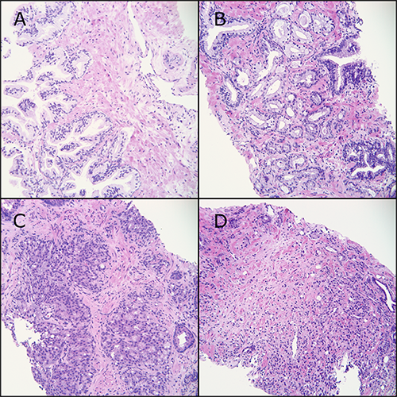

# PANDA Challenge

#### Information from Competition Organizers

Diagnosis of prostate cancer (PCa) is based on the grading of prostate tissue biopsies by pathologists and are scored according to the **Gleason grading system**.

The dataset is the most extensive multi-center dataset on Gleason grading available yet.

- How many centers collected the data? **Only two centers**

After the biopsy is assigned a Gleason score, it is converted into an **ISUP grade** on a 1-5 scale.

Gleason score is important for prognosis of PCa, whereas ISUP grade is more important for deciding a treatment regimen.

Motivation: There is both a risk of missing cancers and a large risk of overgrading resulting in unnecessary treatment. Significant inter-observer variability.

- Could overgrading be present in the dataset?
- How many individual pathologists contributed to the dataset?
  - All the Karolinska images in the training data is graded by the same pathologist.
  - 

The competition organizer has previously shown in two studies that deep learning systems can achieve pathologist-level performance.

- https://www.ncbi.nlm.nih.gov/pubmed/31926805
- Not sure?

Dataset consists of around 11k whole-slide images of digitized **H&E-stained** biopsies originating from **two centers**.

For more information on digital and computational pathology, see e.g. (Bera, 2019) or (Niazi, 2019).

###### Gleason Patterns

Each WSI contains one, or in some cases two, thin tissue sections cut from a single biopsy sample. Samples are stained with H&E. Samples are made up of glandular tissue and connective tissue. Glands are hollow structures, which can be see as white "holes" or branched cavities in the WSI. The appearance of the glands forms the basis of the Gleason grading system. The glandular structure characteristic of healthy prostate tissue is progressively lost with increasing grade. The grading system recognizes three categories: 3, 4, and 5. The Gleason Patterns are characterized as follows:

A. **Gleason Patterns 1 & 2** The cytoplasm is pale and the nuclei small and regular. The glands are grouped together.

B. **Gleason Pattern 3** Has <u>no</u> loss of glandular differentiation. Small glands infiltrate between benign glands. The cytoplasm is often dark and the nuclei enlarged with dark chromatin and some prominent nucleoli. Each epithelial unit is separate and has a lumen.

C. **Gleason Pattern 4** Partial loss of glandular differentiation. There is an attempt to form lumina but the tumor fails to form complete, well-developed glands. This microphotograph shows irregular cribiform cancer (epithelial sheets with multiple lumina). There are also some poorly formed small glands and some fused glands. All of these are included in Gleason Pattern 4.

D. **Gleason Pattern 5** An almost complete loss of glandular differentiation. Dispersed single cancer cells are seen in the stroma. Pattern 5 may also contain solid sheets or strands of cancer cells.

All microphotographs show stains at 20x lens magnification.

###### ISUP Grade

In the case of multiple different Gleason patterns, the score is composed of the most frequently occurring pattern and the second most frequent pattern in the biopsy, as judged by the pathologist. The minority pattern must account for at least 5% of the total area to be included, e.g. if pattern 3 is less than 5%, the Gleason score 4 + 3 will instead be 4 + 4. Further, the highest grade should always be part of the score. For example, a biopsy that contains 60% Gleason 4, 37% Gleason 3 and 3% Gleason 5 should get a score of 4 + 5 = 9. For details see (Epstein, 2016).

According to current guidelines by the International Society of Urological Pathology (ISUP), the Gleason scores are summarized into an ISUP grade on a scale from 1 to 5 according to the following rule:

If there is no cancer in the sample, we use the label ISUP grade 0 in this competition. 

They invited expert pathologists to label the test data, and derived a consensus label. See Egevad, 2013 for more information on inter-pathologist variation in Gleason grading.

###### Dataset Description

**Mask Labeling**

<u>Radboud</u>: Prostate glands are individually labeled. Valid values are:
0: background (non tissue) or unknown
1: stroma (connective tissue, non-epithelium tissue)
2: healthy (benign) epithelium
3: cancerous epithelium (Gleason 3)
4: cancerous epithelium (Gleason 4)
5: cancerous epithelium (Gleason 5)

<u>Karolinska</u>: Regions are labeled. Valid values are:
1: background (non tissue) or unknown
2: benign tissue (stroma and epithelium combined)
3: cancerous tissue (stroma and epithelium combined)

#### Literature of Computational Gleason grading

- Bulten et al., 2020. Automated deep-learning system for Gleason grading of prostate cancer using biopsies: a diagnostic study. The Lancet Oncology. [[Link](Literature/Bulten2020.pdf)]
- Ström & Kartasalo et al., 2020. Artificial intelligence for diagnosis and grading of prostate cancer in biopsies: a population-based, diagnostic study. The Lancet Oncology. [[Link](Literature/StromKartasalo2020.pdf)]
- Bera et al., 2019. Artificial intelligence in digital pathology—new tools for diagnosis and precision oncology. Nature Reviews Clinical Oncology, 16(11), 703-715.
- Egevad et al., 2013. Standardization of Gleason grading among 337 European pathologists. Histopathology, 62(2), 247-256.

- Epstein et al, 2016. The 2014 International Society of Urological Pathology (ISUP) consensus conference on gleason grading of prostatic carcinoma definition of grading patterns and proposal for a new grading system. Am J Surg Pathol; 40: 244–52.
- Niazi et al., 2019. Digital pathology and artificial intelligence. The Lancet Oncology, 20(5), e253-e261.

**Examples of Developed Systems**

https://camelyon17.grand-challenge.org/evaluation/results/

